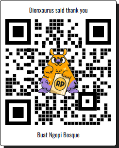

# SIGAP

> Proyek ini merupakan karya asli saya. Mohon sertakan kredit ketika menggunakan atau membagikan ulang.

SIGAP adalah aplikasi internal berbasis React + TypeScript + Express untuk memonitor aktivitas, khususnya log akses dan pemindaian KTP, dengan integrasi Supabase sebagai backend layanan data.

## Teknologi Utama
- React 19 + Vite 7 untuk antarmuka pengguna yang responsif.
- Express 5 + ts-node sebagai API server lokal.
- Supabase untuk penyimpanan data dan autentikasi.
- Tailwind CSS 4 untuk styling yang konsisten.

## Prasyarat
- Node.js 18 LTS atau lebih baru.
- npm 10 atau lebih baru.
- Akun Supabase dengan project dan kredensial yang sudah disiapkan.

## Memulai
1. Clone repositori ini:
   ```bash
   git clone https://github.com/<username>/sigap.git
   cd sigap
   ```
2. Duplikat file contoh environment lalu isi sesuai kredensial Anda:
   ```bash
   cp .env.example .env
   ```
3. Instal dependensi:
   ```bash
   npm install
   ```
4. Jalankan aplikasi dalam mode pengembangan (frontend + server):
   ```bash
   npm run dev
   ```
5. Aplikasi frontend berjalan di `http://localhost:5173`, sedangkan API server aktif melalui skrip `nodemon` pada port yang didefinisikan di `.env`.

## Skrip npm
- `npm run dev`: Menjalankan Vite dan server Express secara bersamaan.
- `npm run dev:vite`: Hanya menjalankan frontend Vite.
- `npm run dev:server`: Hanya menjalankan server Express dengan ts-node.
- `npm run build`: Membangun aset produksi Vite.
- `npm run preview`: Menjalankan server preview hasil build.

## Konfigurasi Lingkungan
Isi variabel `.env` dengan kredensial Supabase, API key eksternal (misal Gemini), serta konfigurasi port lokal. Contoh format dapat dilihat di `.env.example`.

Struktur SQL, termasuk definisi tabel log dan data referensi, tersedia di `supabase/schema.sql`. Pastikan struktur tersebut sudah diaplikasikan pada project Supabase Anda sebelum menjalankan aplikasi produksi.

## Kontribusi
Proyek ini belum terbuka untuk kontribusi eksternal. Jika Anda menggunakan basis kode ini sebagai acuan, mohon cantumkan atribusi kepada pemilik repositori.

## Dukung Karya Ini
Jika aplikasi ini bermanfaat, Anda dapat memberikan dukungan melalui Saweria. Cukup scan QR berikut atau buka tautan langsung:

[](https://saweria.co/c225fe724bd37018534e970dee79510f)

Terima kasih sudah menghargai karya ini!
